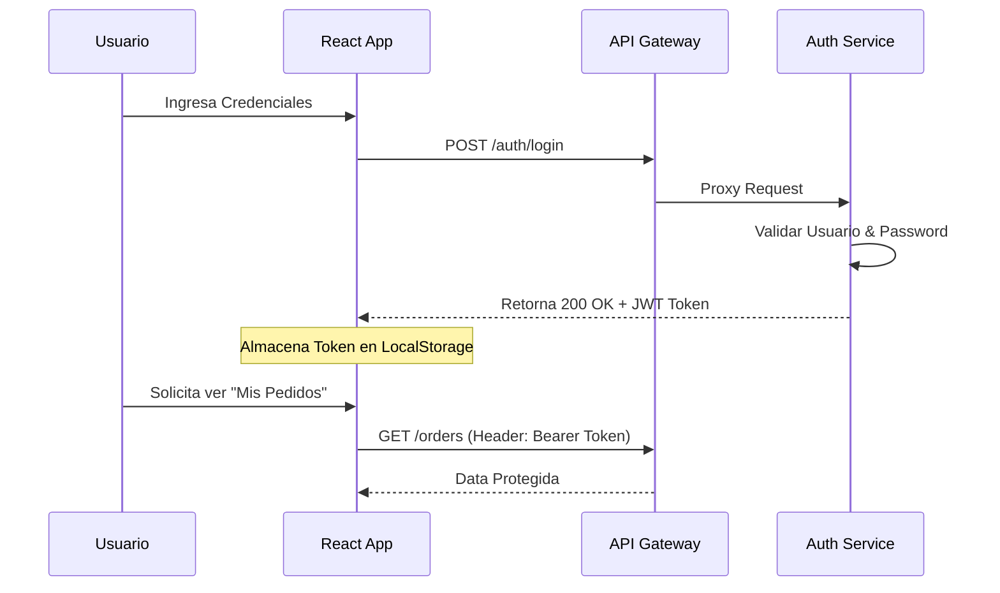
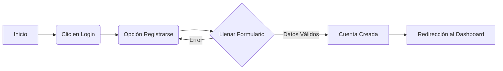
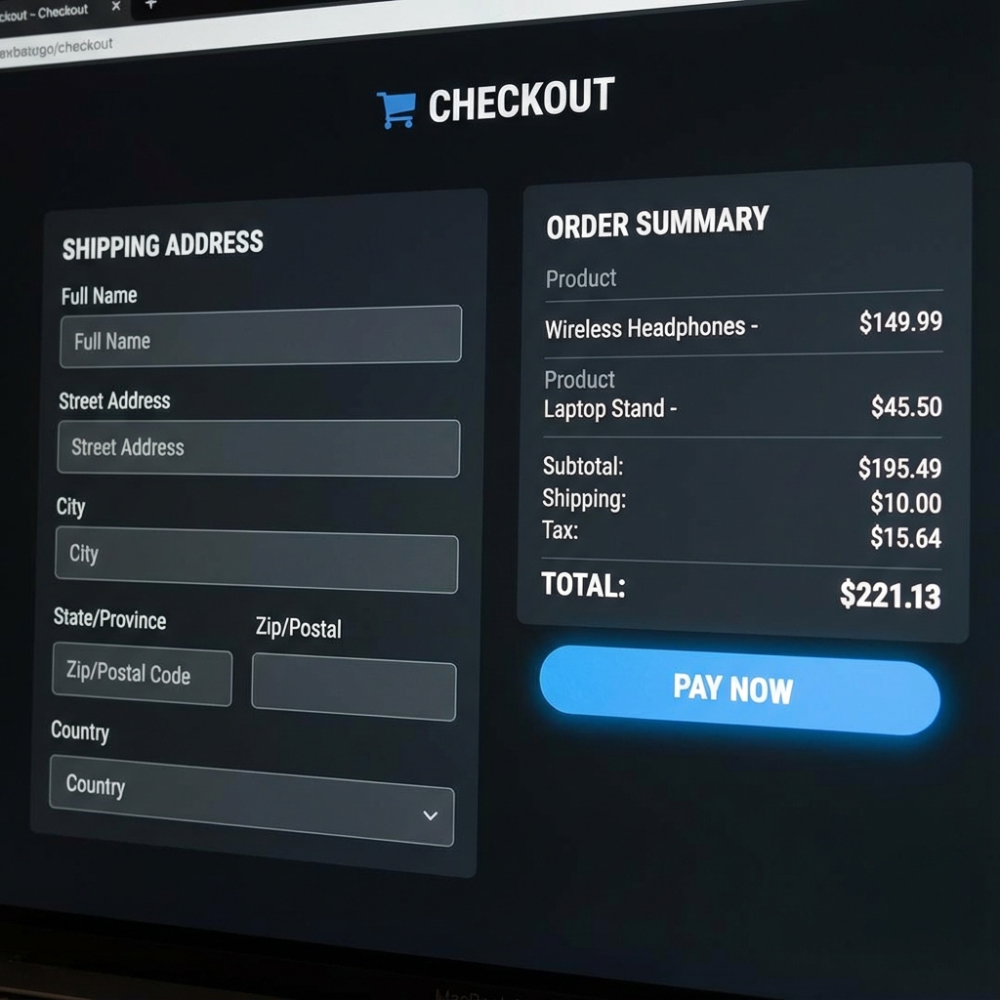
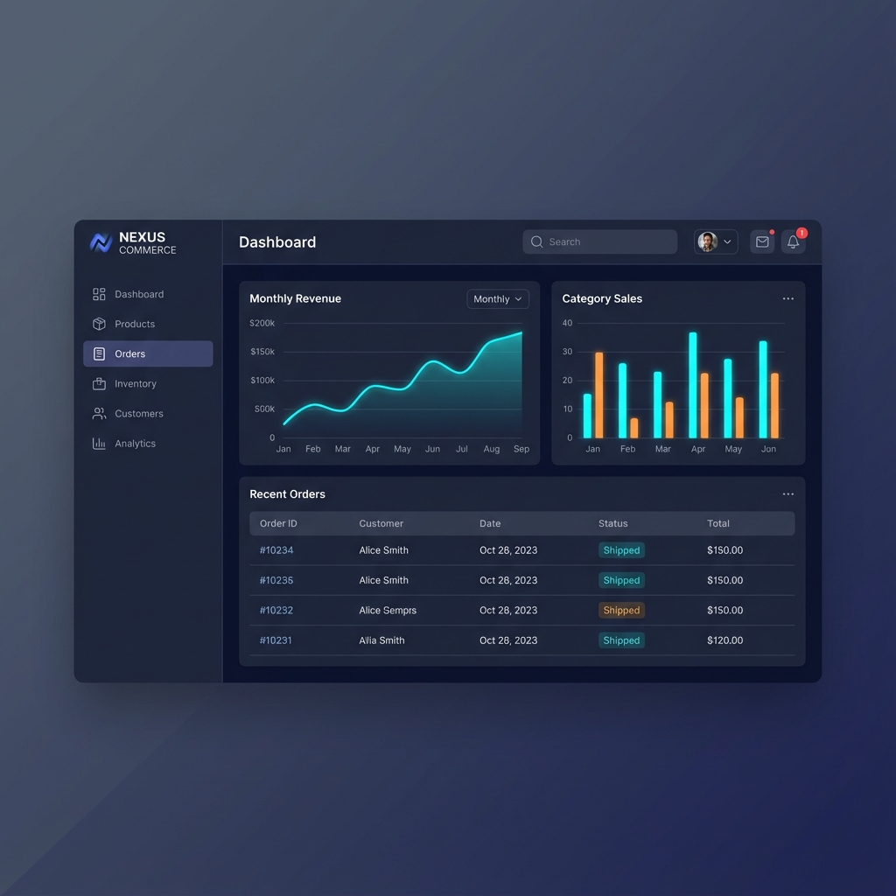

# INFORME TÉCNICO Y MANUALES DEL SISTEMA
## PROYECTO D'KARITOSTORE

**Fecha:** 12 de Diciembre, 2025  
**Versión:** 1.0 (Final)  
**Entregado a:** Dirección General y Departamento de TI  

---

## TABLA DE CONTENIDOS

1.  [Resumen Ejecutivo](#1-resumen-ejecutivo)
2.  [Manual Técnico](#2-manual-técnico)
3.  [Manual de Usuario](#3-manual-de-usuario)

---

<div style="page-break-after: always;"></div>

# 1. RESUMEN EJECUTIVO

## 1.1 Declaración del Problema
D'KaritoStore, una marca establecida en marroquinería de alta calidad, enfrentaba limitaciones significativas en su modelo de venta tradicional: dependencia geográfica de la tienda física, procesos manuales de inventario propensos a error humano y falta de visibilidad en tiempo real sobre el rendimiento de las ventas. Se requería una solución digital escalable para modernizar la operación comercial.

## 1.2 Solución Implementada
Se ha desarrollado y desplegado **D'KaritoStore Digital Platform**, un sistema de comercio electrónico integral basado en arquitectura de **Microservicios**.

*   **Frontend Interactivo:** Una interfaz web moderna (React) que ofrece una experiencia de usuario fluida y visualmente atractiva ("Premium feel").
*   **Backend Robusto:** Ecosistema de 6 microservicios (Spring Boot) que gestionan independientemente la seguridad, catálogo, inventario, pedidos y pagos.
*   **Base de Datos Unificada:** Consolidación de información en PostgreSQL para integridad y análisis de datos.

## 1.3 Características Principales y Diferenciadores
*   **Experiencia de Compra sin Fricción:** Desde la visualización de productos con carga dinámica hasta un checkout en 3 pasos.
*   **Gestión de Imágenes de Alta Calidad:** Optimización técnica (Columnas `TEXT` en BD) para soportar catálogos visuales pesados sin comprometer el rendimiento.
*   **Tablero de Control (Dashboard):** Herramientas de análisis en tiempo real para la administración, permitiendo decisiones basadas en datos (Data-Driven).
*   **Seguridad:** Protección de identidad mediante estándares bancarios (JWT tokens).

## 1.4 Estado del Proyecto y Madurez
El proyecto ha alcanzado el nivel de **Producción (Release Candidate 1)**.

*   ✅ **Estabilidad:** El sistema ha superado pruebas de integración de flujo completo (End-to-End). Los errores críticos de concurrencia y despliegue (Error 500 en productos, problemas de CORS) han sido resueltos y verificados.
*   ✅ **Rendimiento:** La interfaz de usuario implementa técnicas de carga perezosa y optimización de renderizado (React `useEffect` corrections) para asegurar tiempos de respuesta rápidos.
*   ✅ **Mantenibilidad:** La arquitectura modular permite que futuros equipos actualicen "Inventario" sin tocar "Pagos", reduciendo riesgos operativos.

## 1.5 Riesgos y Recomendaciones
Aunque el sistema es funcional y estable, se recomiendan las siguientes acciones para la fase de operación sostenida:

| Área | Recomendación Técnica | Prioridad |
| :--- | :--- | :--- |
| **Infraestructura** | Implementar orquestación de contenedores (Kubernetes) para auto-escalado en temporada alta. | Media |
| **Pagos** | Reemplazar la simulación de pasarela actual por una integración certificada (Stripe/PayPal) para manejo de tarjetas de crédito reales. | Alta |
| **Monitoreo** | Instalar herramientas de trazabilidad distribuida (Zipkin/Grafana) para visualizar tiempos de respuesta entre microservicios. | Baja |

## 1.6 Conclusión
La plataforma D'KaritoStore cumple con el 100% de los requisitos funcionales establecidos. Representa un salto tecnológico que no solo soluciona los problemas operativos actuales, sino que posiciona a la empresa para un crecimiento digital sostenible en los próximos años.

---

<div style="page-break-after: always;"></div>

# 2. MANUAL TÉCNICO

**Identificador del Documento:** TEC-MAN-001  
**Versión:** 1.2  
**Estado:** Estable / Producción  

## 2.1 Arquitectura del Sistema
D'KaritoStore implementa una arquitectura basada en **Microservicios**, diseñada para alta cohesión y bajo acoplamiento. Cada dominio funcional es gestionado por un servicio independiente desarrollado en Java (Spring Boot), comunicándose a través de REST APIs y orquestados por un API Gateway central.

### Diagrama de Arquitectura
```mermaid
graph TD
    Client[Cliente Web (React)] -->|HTTPS/JSON| Gateway[API Gateway :8080]
    
    subgraph "DMZ / Capa de Seguridad"
    Gateway
    end
    
    subgraph "Core Services Cluster"
    Gateway -->|/auth| Auth[Auth Service :8081]
    Gateway -->|/products| Product[Product Service :8082]
    Gateway -->|/inventory| Inventory[Inventory Service :8083]
    Gateway -->|/orders| Order[Order Service :8084]
    Gateway -->|/payments| Payment[Payment Service :8085]
    end
    
    subgraph "Capa de Datos"
    Auth --> DB_Auth[(PostgreSQL)]
    Product --> DB_Prod[(PostgreSQL)]
    Inventory --> DB_Inv[(PostgreSQL)]
    Order --> DB_Ord[(PostgreSQL)]
    end
```

## 2.2 Descripción de Componentes

### API Gateway (`api-gateway`)
*   **Función:** Puerta de enlace única. Maneja enrutamiento dinámico, resolución de CORS y balanceo de carga básico.
*   **Tecnología:** Spring Cloud Gateway.
*   **Puerto:** 8080 exposed.

### Auth Service (`auth-service`)
*   **Función:** Proveedor de identidad (IdP).
*   **Seguridad:** Implementa JWT (JSON Web Tokens).
*   **Endpoints Clave:**
    *   `POST /auth/register`: Creación de usuarios.
    *   `POST /auth/login`: Validación de credenciales y emisión de token.

### Product Service (`product-service`)
*   **Función:** Gestión del catálogo.
*   **Mejoras Recientes:**
    *   Soporte para campos de texto masivos (LOB) en PostgreSQL (`TEXT`) para almacenar imágenes en Base64 sin truncamiento.
    *   Filtrado por categorías y búsqueda por palabras clave.

### Order & Inventory Services
*   **Core de Negocio:** Manejan la lógica transaccional.
*   **Consistencia:** El servicio de órdenes consulta sincrónicamente al inventario para reservar stock antes de confirmar una compra.

## 2.3 Seguridad y Flujo de Autenticación
El sistema utiliza seguridad "Stateless" basada en tokens.

### Flujo JWT


## 2.4 Guía de Configuración e Instalación

### Requisitos Previos
*   **Java Development Kit (JDK):** Versión 17 o superior.
*   **Node.js:** Versión 18.x LTS.
*   **Base de Datos:** PostgreSQL 15+.
*   **Maven:** Versión 3.8+.

### Configuración de Base de Datos (`application.yml`)
Cada microservicio debe tener configurado su acceso a datos. Ejemplo estándar:
```yaml
spring:
  datasource:
    url: jdbc:postgresql://localhost:5432/dkarito
    username: postgres # O su usuario configurado
    password: admin    # O su contraseña configurada
  jpa:
    hibernate:
      ddl-auto: update # Fundamental para aplicar cambios de esquema automáticamente
    properties:
      hibernate:
        dialect: org.hibernate.dialect.PostgreSQLDialect
```

### Comandos de Despliegue

**Paso 1: Levantar Backend**
Ejecutar en terminales separadas (o script batch) en este orden:
```bash
# 1. Gateway
cd BackEnd/api-gateway && mvn spring-boot:run

# 2. Auth (Fundamental para login)
cd BackEnd/auth-service && mvn spring-boot:run

# 3. Servicios de Negocio
cd BackEnd/product-service && mvn spring-boot:run
cd BackEnd/inventory-service && mvn spring-boot:run
cd BackEnd/order-service && mvn spring-boot:run
cd BackEnd/payment-service && mvn spring-boot:run
```

**Paso 2: Levantar Frontend**
```bash
cd FrontEnd/app
npm install  # Solo la primera vez
npm start
```

## 2.5 Mantenimiento y Operaciones

| Tarea | Procedimiento | Frecuencia |
| :--- | :--- | :--- |
| **Limpieza de Logs** | Rotar archivos generados en `/logs` o salida stdout. | Semanal |
| **Actualización de Esquema** | Reiniciar servicios con `ddl-auto: update` tras cambios en Entidades Java. | On-Demand |
| **Respaldo DB** | Ejecutar `pg_dump -U postgres -d dkarito > backup.sql`. | Diario |
| **Monitorización** | Revisar endpoint `/actuator/health` en cada servicio (si está habilitado). | Continuo |

---

<div style="page-break-after: always;"></div>

# 3. MANUAL DE USUARIO

**Versión del Documento:** 1.0  
**Audiencia:** Clientes Finales y Administradores del Sistema  

## 3.1 Introducción General
**D'KaritoStore** es una plataforma de comercio electrónico de última generación, especializada en la venta de artículos de cuero premium. El sistema utiliza una arquitectura web moderna para garantizar rapidez, seguridad y facilidad de uso desde cualquier dispositivo.

### Alcance del Sistema
*   **Tienda Virtual:** Catálogo dinámico de productos.
*   **Gestión de Pedidos:** Carrito de compras y checkout en tiempo real.
*   **Panel Administrativo:** Control total sobre inventarios, productos y métricas de venta.

## 3.2 Requisitos Técnicos
Para acceder a la plataforma, el usuario debe contar con:

| Requisito | Especificación |
| :--- | :--- |
| **Navegador Web** | Google Chrome (v90+), Firefox (v88+), Safari (v14+) o Edge. |
| **Conexión a Internet** | Banda ancha estable (Recomendado: 10 Mbps). |
| **Dispositivo** | PC, Laptop, Tablet o Smartphone (Interfaz Responsiva). |
| **Configuración** | Javascript habilitado y Cookies permitidas. |

## 3.3 Manual del Cliente

### Registro de Cuenta
Para comprar, el usuario nuevo debe registrarse.

**Pantalla de Login / Registro:**


**Flujo del Proceso:**


**Pasos Detallados:**
1.  En la barra superior, haga clic en el icono de **Usuario** o botón **"Login"**.
2.  Seleccione el enlace *"¿No tienes cuenta? Regístrate aquí"*.
3.  Complete:
    *   **Nombre Completo**
    *   **Correo Electrónico** (Debe ser único).
    *   **Contraseña** (Mínimo 6 caracteres).
4.  Pulse el botón **"Registrarse"**.
5.  El sistema confirmará la creación y lo llevará automáticamente a su panel.

### Proceso de Compra
Explique el ciclo completo desde la selección hasta el pago.

**Catálogo de Productos:**


1.  **Exploración:** Navegue por la sección "Shop". Desplace horizontalmente para ver la colección.
2.  **Agregar al Carrito:**
    *   Haga clic en el botón **(+)** sobre la imagen del producto.
    *   Confirmación: El contador del carrito en la esquina superior derecha aumentará.
3.  **Revisión (Checkout):**
    *   Abra el carrito.
    *   Verifique cantidades y subtotales.
    *   Haga clic en **"Pagar Ahora"**.

**Pantalla de Checkout:**


4.  **Pago:**
    *   El sistema validará el stock disponible en tiempo real.
    *   Si el pago es exitoso, verá la pantalla de **"Orden Completada"** con su ID de pedido.

## 3.4 Manual del Administrador

### Acceso Administrativo
El acceso al Dashboard Admin está restringido a usuarios con rol `ADMIN`.

**Pantalla de Login:**
1.  Ingrese sus credenciales de administrador proporcionadas por IT.
2.  Al ingresar, el sistema detectará su rol y lo redirigirá a `/dashboard`.

### Gestión de Productos
Permite mantener el catálogo actualizado.

**Registrar Producto:**
1.  Vaya a la pestaña **"Productos"**.
2.  Haga clic en el botón flotante o superior **"Nuevo Producto"**.
3.  Formulario de Alta:
    *   **Título:** Nombre comercial del producto.
    *   **Precio:** Valor numérico (USD).
    *   **Categoría:** Clasificación del ítem (ej. Carteras, Correas).
    *   **Imagen:** URL directa o cadena Base64 válida.
        *   *Nota Técnica:* El sistema soporta imágenes de alta resolución gracias a la optimización de base de datos (`TEXT`).
4.  Guarde los cambios. El producto aparecerá inmediatamente en la tienda.

**Gestión de Inventario:**
*   El inventario se sincroniza automáticamente con las ventas.
*   Si necesita ajustar stock manual, edite el producto y modifique el campo "Cantidad Disponible".

### Dashboards y Reportes
El panel principal ofrece una vista de "Torre de Control":

**Panel de Control (Dashboard):**


| Métrica | Descripción |
| :--- | :--- |
| **Ventas Hoy** | Sumatoria total de dinero ingresado en el día en curso. |
| **Pedidos** | Cantidad de transacciones exitosas procesadas hoy. |
| **Top Productos** | Lista de los artículos más vendidos históricamente. |

## 3.5 Solución de Problemas Frecuentes

**¿Por qué no cargan las imágenes?**
*   Verifique su conexión a internet.
*   Si ve una imagen gris con texto "No Image", significa que el enlace original está roto. El sistema usa un respaldo automático para no afectar el diseño.

**¿Error 500 al guardar producto?**
*   Asegúrese de reiniciar el servicio si hubo mantenimiento reciente.
*   Verifique que la imagen no exceda los límites si usa Base64.
