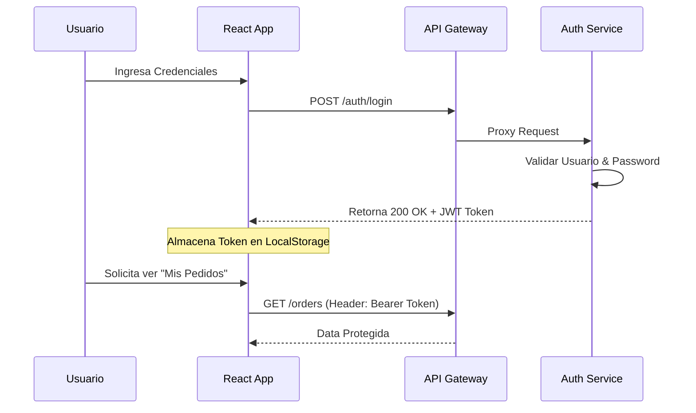

# Manual Técnico - D'KaritoStore

**Identificador del Documento:** TEC-MAN-001  
**Versión:** 1.2  
**Estado:** Estable / Producción  

---

## 1. Arquitectura del Sistema
D'KaritoStore implementa una arquitectura basada en **Microservicios**, diseñada para alta cohesión y bajo acoplamiento. Cada dominio funcional es gestionado por un servicio independiente desarrollado en Java (Spring Boot), comunicándose a través de REST APIs y orquestados por un API Gateway central.

### 1.1. Diagrama de Arquitectura
```mermaid
graph TD
    Client[Cliente Web (React)] -->|HTTPS/JSON| Gateway[API Gateway :8080]
    
    subgraph "DMZ / Capa de Seguridad"
    Gateway
    end
    
    subgraph "Core Services Cluster"
    Gateway -->|/auth| Auth[Auth Service :8081]
    Gateway -->|/products| Product[Product Service :8082]
    Gateway -->|/inventory| Inventory[Inventory Service :8083]
    Gateway -->|/orders| Order[Order Service :8084]
    Gateway -->|/payments| Payment[Payment Service :8085]
    end
    
    subgraph "Capa de Datos"
    Auth --> DB_Auth[(PostgreSQL)]
    Product --> DB_Prod[(PostgreSQL)]
    Inventory --> DB_Inv[(PostgreSQL)]
    Order --> DB_Ord[(PostgreSQL)]
    end
```

---

## 2. Descripción de Componentes

### 2.1. API Gateway (`api-gateway`)
*   **Función:** Puerta de enlace única. Maneja enrutamiento dinámico, resolución de CORS y balanceo de carga básico.
*   **Tecnología:** Spring Cloud Gateway.
*   **Puerto:** 8080 exposed.

### 2.2. Auth Service (`auth-service`)
*   **Función:** Proveedor de identidad (IdP).
*   **Seguridad:** Implementa JWT (JSON Web Tokens).
*   **Endpoints Clave:**
    *   `POST /auth/register`: Creación de usuarios.
    *   `POST /auth/login`: Validación de credenciales y emisión de token.

### 2.3. Product Service (`product-service`)
*   **Función:** Gestión del catálogo.
*   **Mejoras Recientes:**
    *   Soporte para campos de texto masivos (LOB) en PostgreSQL (`TEXT`) para almacenar imágenes en Base64 sin truncamiento.
    *   Filtrado por categorías y búsqueda por palabras clave.

### 2.4. Order & Inventory Services
*   **Core de Negocio:** Manejan la lógica transaccional.
*   **Consistencia:** El servicio de órdenes consulta sincrónicamente al inventario para reservar stock antes de confirmar una compra.

---

## 3. Seguridad y Flujo de Autenticación
El sistema utiliza seguridad "Stateless" basada en tokens.

### 3.1. Flujo JWT


---

## 4. Guía de Configuración e Instalación

### 4.1. Requisitos Previos
*   **Java Development Kit (JDK):** Versión 17 o superior.
*   **Node.js:** Versión 18.x LTS.
*   **Base de Datos:** PostgreSQL 15+.
*   **Maven:** Versión 3.8+.

### 4.2. Configuración de Base de Datos (`application.yml`)
Cada microservicio debe tener configurado su acceso a datos. Ejemplo estándar:
```yaml
spring:
  datasource:
    url: jdbc:postgresql://localhost:5432/dkarito
    username: postgres # O su usuario configurado
    password: admin    # O su contraseña configurada
  jpa:
    hibernate:
      ddl-auto: update # Fundamental para aplicar cambios de esquema automáticamente
    properties:
      hibernate:
        dialect: org.hibernate.dialect.PostgreSQLDialect
```

### 4.3. Comandos de Despliegue

**Paso 1: Levantar Backend**
Ejecutar en terminales separadas (o script batch) en este orden:
```bash
# 1. Gateway
cd BackEnd/api-gateway && mvn spring-boot:run

# 2. Auth (Fundamental para login)
cd BackEnd/auth-service && mvn spring-boot:run

# 3. Servicios de Negocio
cd BackEnd/product-service && mvn spring-boot:run
cd BackEnd/inventory-service && mvn spring-boot:run
cd BackEnd/order-service && mvn spring-boot:run
cd BackEnd/payment-service && mvn spring-boot:run
```

**Paso 2: Levantar Frontend**
```bash
cd FrontEnd/app
npm install  # Solo la primera vez
npm start
```

---

## 5. Mantenimiento y Operaciones

| Tarea | Procedimiento | Frecuencia |
| :--- | :--- | :--- |
| **Limpieza de Logs** | Rotar archivos generados en `/logs` o salida stdout. | Semanal |
| **Actualización de Esquema** | Reiniciar servicios con `ddl-auto: update` tras cambios en Entidades Java. | On-Demand |
| **Respaldo DB** | Ejecutar `pg_dump -U postgres -d dkarito > backup.sql`. | Diario |
| **Monitorización** | Revisar endpoint `/actuator/health` en cada servicio (si está habilitado). | Continuo |

---
**Nota para Desarrolladores:**
Cualquier cambio en la entidad `Product` (especialmente tipos de datos LOB) requiere reinicio del servicio para que Hibernate actualice la definición de la columna en PostgreSQL.
