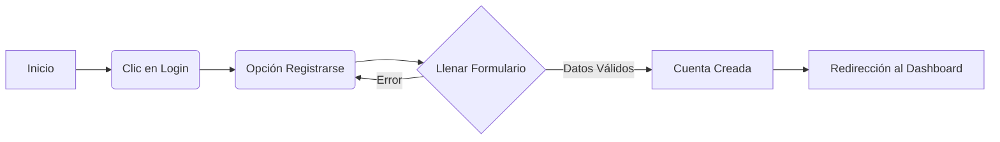

# Manual de Usuario - D'KaritoStore

**Versión del Documento:** 1.0  
**Fecha de Publicación:** 12 de Diciembre, 2025  
**Audiencia:** Clientes Finales y Administradores del Sistema  

---

## 1. Introducción General
**D'KaritoStore** es una plataforma de comercio electrónico de última generación, especializada en la venta de artículos de cuero premium. El sistema utiliza una arquitectura web moderna para garantizar rapidez, seguridad y facilidad de uso desde cualquier dispositivo.

### Alcance del Sistema
*   **Tienda Virtual:** Catálogo dinámico de productos.
*   **Gestión de Pedidos:** Carrito de compras y checkout en tiempo real.
*   **Panel Administrativo:** Control total sobre inventarios, productos y métricas de venta.

---

## 2. Requisitos Técnicos
Para acceder a la plataforma, el usuario debe contar con:

| Requisito | Especificación |
| :--- | :--- |
| **Navegador Web** | Google Chrome (v90+), Firefox (v88+), Safari (v14+) o Edge. |
| **Conexión a Internet** | Banda ancha estable (Recomendado: 10 Mbps). |
| **Dispositivo** | PC, Laptop, Tablet o Smartphone (Interfaz Responsiva). |
| **Configuración** | Javascript habilitado y Cookies permitidas. |

---

## 3. Manual del Cliente

### 3.1. Registro de Cuenta
Para comprar, el usuario nuevo debe registrarse.

**Pantalla de Login / Registro:**

**Flujo del Proceso:**

**Pasos Detallados:**
1.  En la barra superior, haga clic en el icono de **Usuario** o botón **"Login"**.
2.  Seleccione el enlace *"¿No tienes cuenta? Regístrate aquí"*.
3.  Complete:
    *   **Nombre Completo**
    *   **Correo Electrónico** (Debe ser único).
    *   **Contraseña** (Mínimo 6 caracteres).
4.  Pulse el botón **"Registrarse"**.
5.  El sistema confirmará la creación y lo llevará automáticamente a su panel.

### 3.2. Proceso de Compra
Explique el ciclo completo desde la selección hasta el pago.

**Catálogo de Productos:**

1.  **Exploración:** Navegue por la sección "Shop". Desplace horizontalmente para ver la colección.
2.  **Agregar al Carrito:**
    *   Haga clic en el botón **(+)** sobre la imagen del producto.
    *   Confirmación: El contador del carrito en la esquina superior derecha aumentará.
3.  **Revisión (Checkout):**
    *   Abra el carrito.
    *   Verifique cantidades y subtotales.
    *   Haga clic en **"Pagar Ahora"**.

**Pantalla de Checkout:**

4.  **Pago:**
    *   El sistema validará el stock disponible en tiempo real.
    *   Si el pago es exitoso, verá la pantalla de **"Orden Completada"** con su ID de pedido.

---

## 4. Manual del Administrador

### 4.1. Acceso Administrativo
El acceso al Dashboard Admin está restringido a usuarios con rol `ADMIN`.

**Pantalla de Login:**
1.  Ingrese sus credenciales de administrador proporcionadas por IT.
2.  Al ingresar, el sistema detectará su rol y lo redirigirá a `/dashboard`.

### 4.2. Gestión de Productos
Permite mantener el catálogo actualizado.

**Registrar Producto:**
1.  Vaya a la pestaña **"Productos"**.
2.  Haga clic en el botón flotante o superior **"Nuevo Producto"**.
3.  Formulario de Alta:
    *   **Título:** Nombre comercial del producto.
    *   **Precio:** Valor numérico (USD).
    *   **Categoría:** Clasificación del ítem (ej. Carteras, Correas).
    *   **Imagen:** URL directa o cadena Base64 válida.
        *   *Nota Técnica:* El sistema soporta imágenes de alta resolución gracias a la optimización de base de datos (`TEXT`).
4.  Guarde los cambios. El producto aparecerá inmediatamente en la tienda.

**Gestión de Inventario:**
*   El inventario se sincroniza automáticamente con las ventas.
*   Si necesita ajustar stock manual, edite el producto y modifique el campo "Cantidad Disponible".

### 4.3. Dashboards y Reportes
El panel principal ofrece una vista de "Torre de Control":

**Panel de Control (Dashboard):**

| Métrica | Descripción |
| :--- | :--- |
| **Ventas Hoy** | Sumatoria total de dinero ingresado en el día en curso. |
| **Pedidos** | Cantidad de transacciones exitosas procesadas hoy. |
| **Top Productos** | Lista de los artículos más vendidos históricamente. |

---

## 5. Solución de Problemas Frecuentes

**¿Por qué no cargan las imágenes?**
*   Verifique su conexión a internet.
*   Si ve una imagen gris con texto "No Image", significa que el enlace original está roto. El sistema usa un respaldo automático para no afectar el diseño.

**¿Error 500 al guardar producto?**
*   Asegúrese de reiniciar el servicio si hubo mantenimiento reciente.
*   Verifique que la imagen no exceda los límites si usa Base64.
